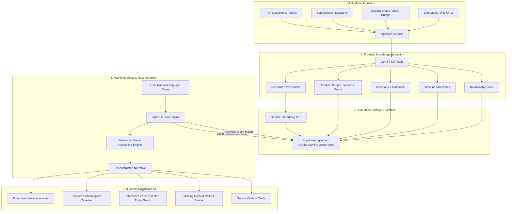

# ReTrace — AI-Powered Lost Context Recovery Tool

[](https://nextjs.org/)
[](https://fastapi.tiangolo.com/)
[](https://deepmind.google/technologies/gemini/)
[](https://supabase.com/)
[](LICENSE)

**ReTrace** reconstructs the missing architectural context and rationale behind past engineering and product decisions. By ingesting scattered documentation (RFCs, Slack transcripts, meeting minutes, incident postmortems, and architecture diagrams), ReTrace utilizes Google Gemini and hybrid vector retrieval to answer *"what happened, why was it decided, who authorized it, and what context was never recorded."*

---

## 🏛 Architectural Blueprint Aesthetic

Designed around an architectural drafting aesthetic:
- **Parchment Canvas**: Cream drafting background (`#FAF8F5`) with technical grid coordinate patterns.
- **Drafting Accents**: Muted ochre (`#D97706`), sage green (`#059669`), slate blueprint navy (`#1E293B`), and terracotta rust (`#DC2626`) for forensic warnings.
- **Strict Evidence Transparency**: Zero hallucination policy — every claim is backed by direct quotes and exact source citations. Any missing rationale is prominently flagged in a dedicated **Missing Context** banner.

---

## ⚡ System Architecture



---

## 🚀 Tech Stack

- **Frontend**: Next.js 14 (App Router), React 18, TypeScript, Tailwind CSS, Lucide Icons
- **Graph Visualizer**: `react-force-graph-2d` (Client-side HTML5 Canvas force-directed topology)
- **Backend**: Python 3.10+, FastAPI, Pydantic v2, Uvicorn
- **AI & LLM**: Google Gemini API (`models/gemini-3.6-flash` for extraction & reasoning, `models/gemini-embedding-001` for 768-dim embeddings)
- **Database & Vectors**: 
  - **Live Mode**: Supabase PostgreSQL with `pgvector` HNSW vector indexing
  - **Zero-Config Local Mode**: Embedded SQLite + NumPy cosine similarity engine for instant offline execution
- **Document Parsers**: PyPDF (PDF text), BeautifulSoup4 & HTTPX (Web scraping), Gemini Vision (Image OCR & diagram parsing)

---

## 📁 Repository Structure

```
retrace-ai/
├── backend/
│   ├── app/
│   │   ├── main.py              # FastAPI application & CORS configuration
│   │   ├── config.py            # Environment settings & validation
│   │   ├── db.py                # Dual-mode Supabase / SQLite storage layer
│   │   ├── models.py            # Pydantic schemas for entities and responses
│   │   ├── api/
│   │   │   ├── ingest.py        # /api/ingest endpoints (file, text, url)
│   │   │   └── query.py         # /api/query & /api/context endpoints
│   │   └── services/
│   │       ├── extractor.py     # Multi-format document parser & chunker
│   │       ├── gemini_service.py# Structured entity/event extraction
│   │       ├── embedding_service.py # Gemini 768-dim embeddings
│   │       └── retrieval_service.py # Hybrid search & context synthesis
│   ├── tests/
│   │   └── test_integration.py  # End-to-end integration test suite
│   ├── schema.sql               # Supabase PostgreSQL + pgvector schema
│   ├── requirements.txt
│   ├── .env.example
│   └── run.py
├── frontend/
│   ├── src/
│   │   ├── app/
│   │   │   ├── page.tsx         # Main interactive dashboard
│   │   │   ├── layout.tsx
│   │   │   └── globals.css      # Architectural drafting styles & grid
│   │   ├── components/
│   │   │   ├── Navbar.tsx
│   │   │   ├── QueryConsole.tsx
│   │   │   ├── NarrativeCard.tsx
│   │   │   ├── MissingContextCallout.tsx
│   │   │   ├── TimelineView.tsx
│   │   │   ├── RelationshipGraph.tsx
│   │   │   ├── EvidencePanel.tsx
│   │   │   ├── IngestionZone.tsx
│   │   │   └── DocumentLibrary.tsx
│   │   └── lib/
│   │       ├── api.ts          # Backend API client
│   │       └── types.ts        # TypeScript contracts
│   ├── package.json
│   ├── tailwind.config.ts
│   └── .env.example
├── README.md
└── .gitignore
```

---

## 🛠 Quick Start Setup

### Prerequisites
- Node.js 18+ & npm
- Python 3.10+
- Google Gemini API Key ([Get one here](https://aistudio.google.com/))

### 1. Backend Setup

```bash
cd backend

# Create virtual environment
python -m venv .venv

# Activate virtual environment
# On Windows:
.\.venv\Scripts\activate
# On Linux/macOS:
source .venv/bin/activate

# Install dependencies
pip install -r requirements.txt

# Configure environment variables
cp .env.example .env
```

Edit `backend/.env`:
```env
GEMINI_API_KEY=your_gemini_api_key_here
HOST=127.0.0.1
PORT=8000
ENVIRONMENT=development
CORS_ORIGINS=http://localhost:3000,http://127.0.0.1:3000

# (Optional) Supabase Credentials
# If left empty, ReTrace seamlessly uses local SQLite + NumPy vector search
SUPABASE_URL=
SUPABASE_KEY=
```

Start the backend server:
```bash
python run.py
# API runs at http://127.0.0.1:8000
# Interactive Swagger docs at http://127.0.0.1:8000/docs
```

### 2. Frontend Setup

```bash
cd ../frontend

# Install dependencies
npm install

# Configure environment
cp .env.example .env

# Run development server
npm run dev
# Frontend runs at http://localhost:3000
```

---

## 🧪 Testing the Application

### Option A: One-Click Demo Load
1. Open `http://localhost:3000` in your browser.
2. Click **"Load Meridian Demo"** in the top navigation or hero banner.
3. This seeds **"Project Meridian: The Architecture Pivot"** (an RFC, an emergency Slack incident thread, and a retrospective).
4. ReTrace will automatically execute a forensic recovery query:
   > *"Why did we switch to PostgreSQL and change the vector index on August 12?"*
5. Inspect the reconstructed **Narrative**, **Stepped Timeline**, **Interactive Entity Graph**, and **Missing Context Flags**.

### Option B: Run Automated Integration Tests
```bash
cd backend
.\.venv\Scripts\python.exe tests/test_integration.py
```

---

## 🗄 Optional: Supabase & pgvector Setup

To run ReTrace directly against Supabase PostgreSQL:
1. Create a project at [supabase.com](https://supabase.com).
2. Open the **SQL Editor** in Supabase and paste the contents of [`backend/schema.sql`](backend/schema.sql).
3. Copy your project URL and service role key into `backend/.env`:
   ```env
   SUPABASE_URL=https://your-project.supabase.co
   SUPABASE_KEY=your_supabase_key
   ```
4. Restart the backend server. ReTrace will automatically detect Supabase and run vector queries via the `match_chunks` RPC function.

---

## 🛡 Security & Privacy
- **API Keys**: All API keys and environment files are strictly excluded via `.gitignore`.
- **Zero Hallucination Guarantee**: When historical records lack specific details, ReTrace refuses to fabricate rationale and explicitly lists them as unrecovered items in the Missing Context panel.

---

## 📄 License
MIT License. Created with Google Gemini & Antigravity.
